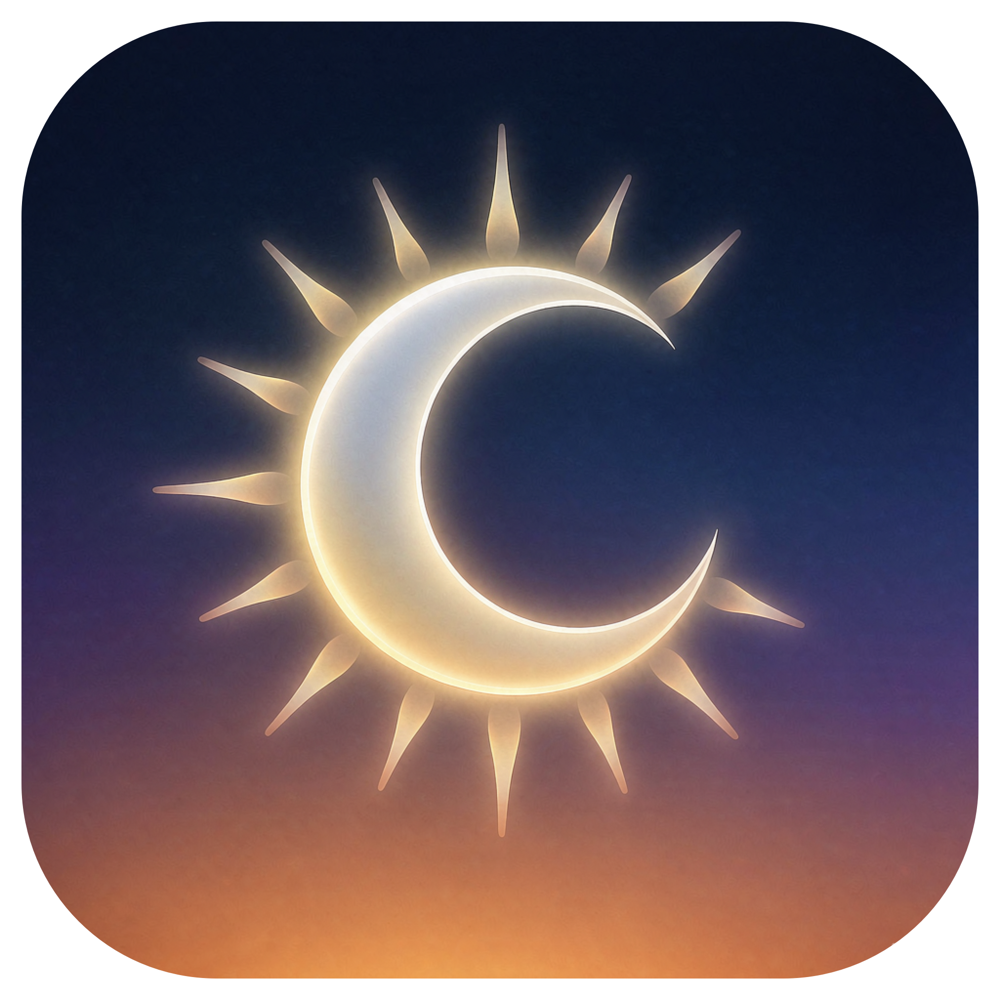

# KeepAwake

A tiny, native **macOS menu bar app** (pure Swift/AppKit, no dependencies) that keeps your Mac awake — with fine-grained control over **idle sleep**, **lid-close sleep**, and whether the **screen** stays on.



## Features

| Menu item | What it does |
|---|---|
| **Block Idle Sleep** | Prevents the system from sleeping due to inactivity. Uses an IOKit power assertion — no root required. Active only while the app runs. |
| **Block Lid Sleep** | Prevents the system from sleeping when you close the lid (`pmset -a disablesleep 1`). Lets you keep downloads/jobs running with the lid closed. Requires one-time privileged helper install (or an admin password per use). |
| **Auto-off Timer** | 30 min / 1 / 2 / 4 / 8 hours, or "manual" (never). When the timer ends, **everything is restored** to system defaults automatically — so a forgotten session never drains your battery. |
| **Keep Screen Awake** | Optional add-on. Only available while at least one block is active. Keeps the display awake as well. |
| **Launch at Login** | Standard `SMAppService` login item. |

The status icon shows 🌙 when sleep is allowed and ☀️ while a block is active, with a live countdown next to it when a timer is set.

## How screen sleep works (and what this app touches)

- **Lid open:** the display sleeps on its own idle timer. "Keep Screen Awake" suppresses that timer with a `PreventUserIdleDisplaySleep` assertion.
- **Lid closed:** normally macOS turns the internal display off and sleeps the system. Since `disablesleep` swallows the entire lid event (screen included), KeepAwake watches the lid state via `AppleClamshellState` (IOPMrootDomain) and explicitly runs `pmset displaysleepnow` when the lid closes — unless "Keep Screen Awake" is checked. Opening the lid wakes the display (`caffeinate -u`).

In short: **blocking sleep never forces your screen on**, and the screen toggle can never be used standalone.

## Install

1. Download `KeepAwake.dmg` from the [latest release](../../releases/latest).
2. Open it and drag **KeepAwake.app** into **Applications**.
3. Launch it. Since the app is ad-hoc signed (not notarized), macOS may ask for confirmation: go to **System Settings → Privacy & Security** and click **Open Anyway**.

### Enable password-free lid control (recommended, one-time)

```bash
sudo /Applications/KeepAwake.app/Contents/PlugIns/install-helper.sh
```

> If the script isn't bundled at that path, grab it from [`helper/install-helper.sh`](helper/install-helper.sh) in this repo.

This installs a small root LaunchDaemon (`com.local.keepawake.helper`) that applies `pmset -a disablesleep 1/0` on behalf of the app, so no password prompt appears when you toggle lid blocking. Uninstall it any time with `helper/uninstall-helper.sh`.

## Build from source

```bash
git clone https://github.com/wulitou-li/KeepAwake.git
cd KeepAwake
./build.sh   # compiles with swiftc, signs ad-hoc, installs to /Applications
```

Requirements: macOS 13+, Xcode Command Line Tools (`xcode-select --install`).

## Uninstall

1. Quit KeepAwake from its menu.
2. Remove the app from `/Applications`.
3. If you installed the privileged helper: `sudo helper/uninstall-helper.sh`.

## Notes

- Built and tested on Apple Silicon (arm64), macOS 26. Universal-source but compiled per-arch by `build.sh`.
- The privileged helper is intentionally tiny: a shell script + LaunchDaemon that writes `pmset -a disablesleep` based on a state file readable only by the app's group. Review it before installing.
- This app changes system power settings — use the timer if you're on battery.

## License

[MIT](LICENSE)
